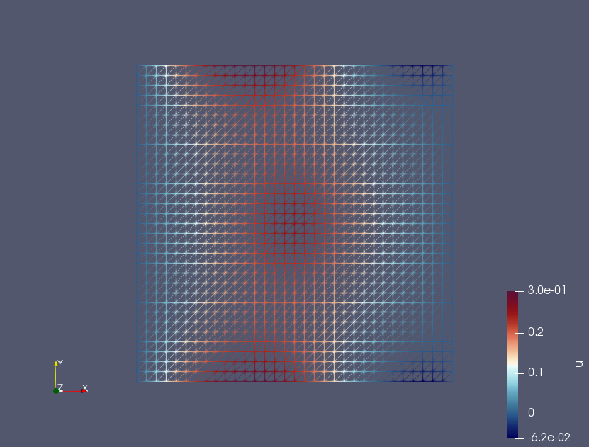
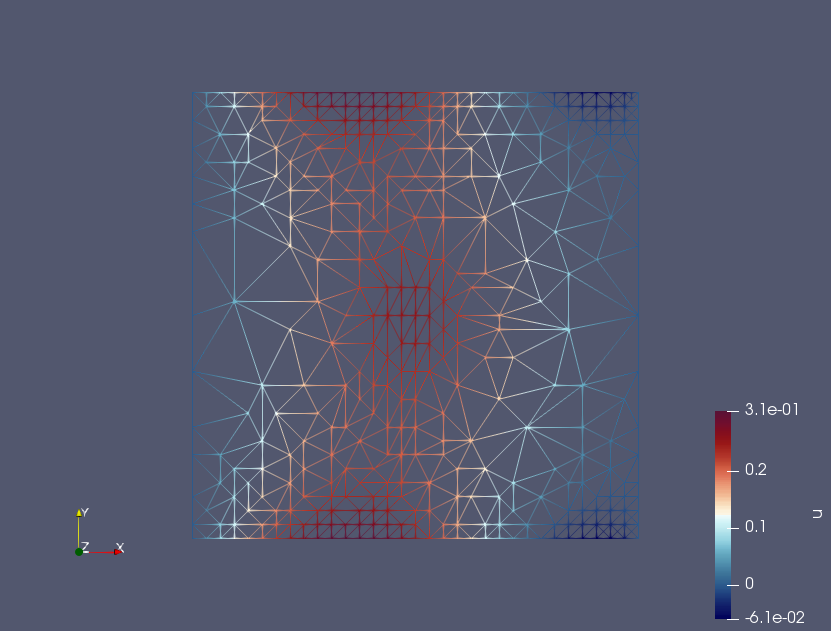
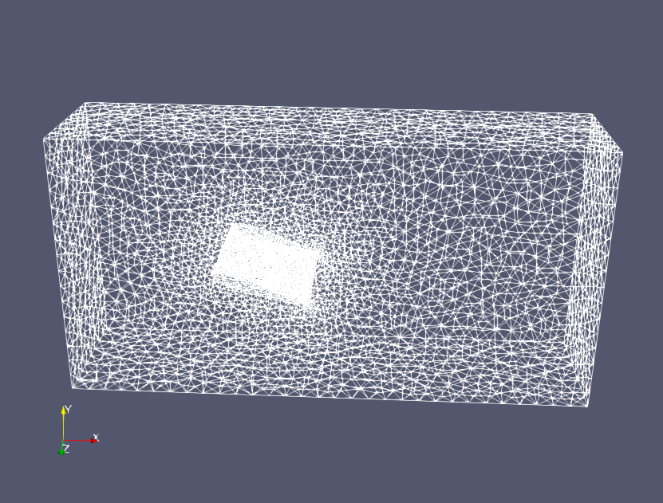
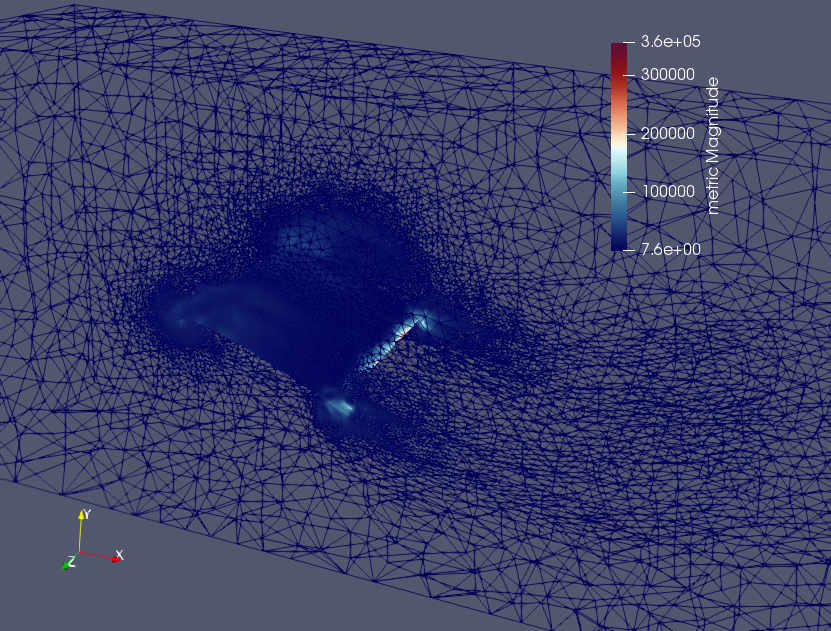
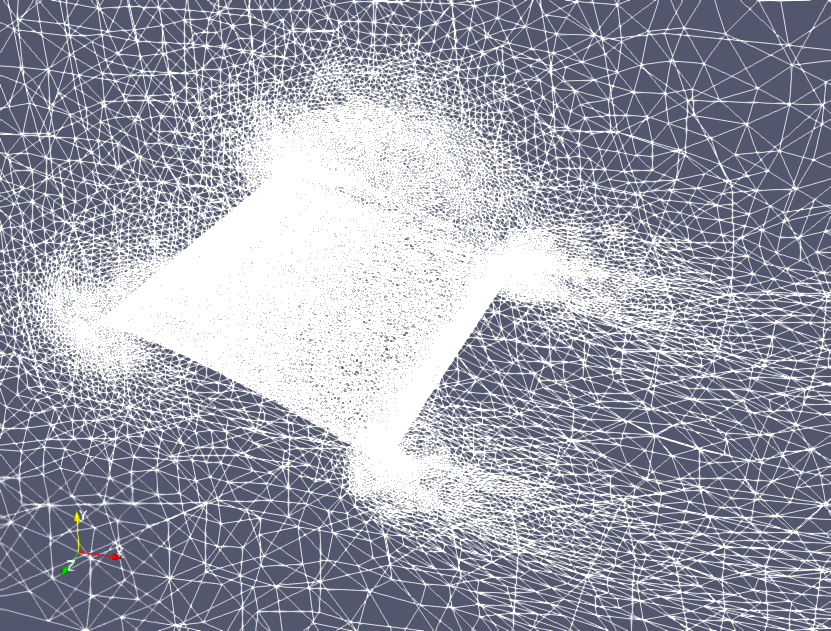

# FEniCS_Omega_h

FEniCS  simulations in fluid/solid mechanics with omega_h mesh adaptivity 

The forked Omega_h repository that contains all the modifications necessary to make the latest version v9.24.2, demos and examples work with the latest FEniCS version v2018.1.0 is available on github https://github.com/tamaradanceva/omega_h/tree/FEniCS, in the FEniCS branch.

## Poisson equation 

## DFS simulation of turbulent flow past a NACA wing

